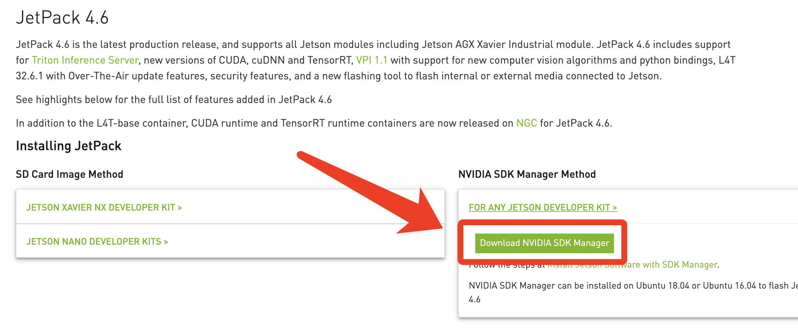
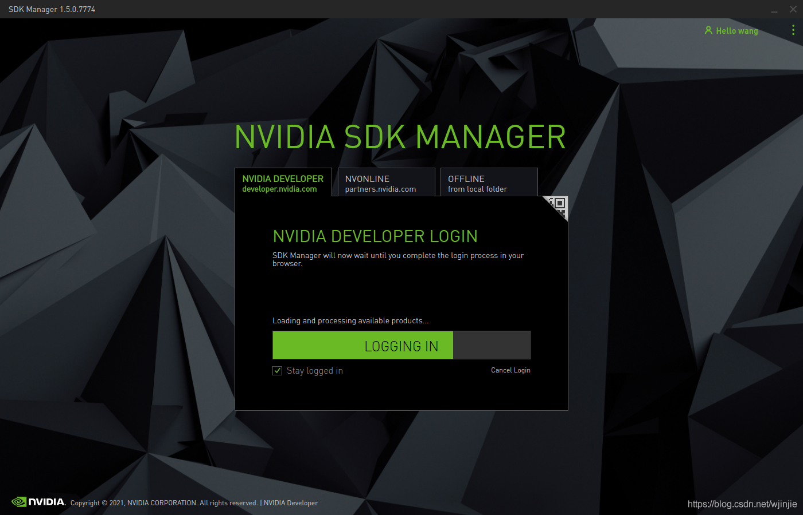
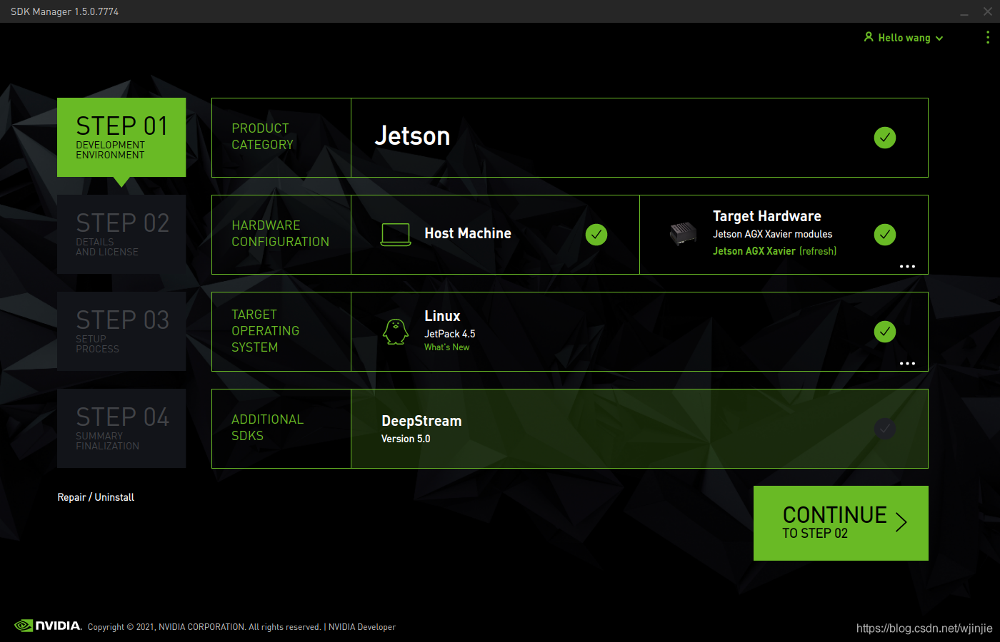
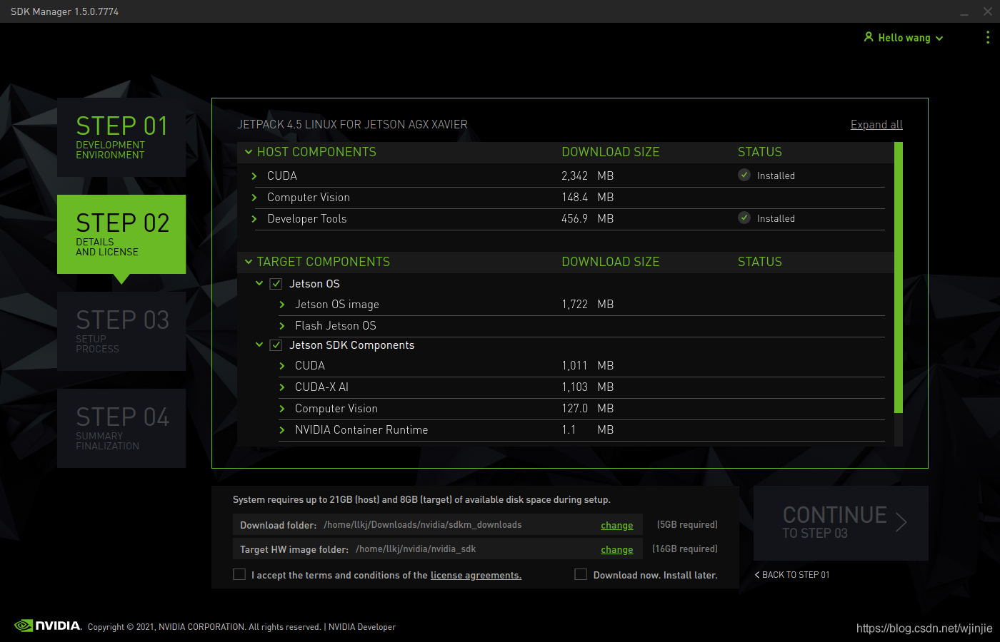

&emsp;
# AGX 刷机

## 实验环境
- 电脑系统：Mac OS
- 工具：VMWARE Fusion
    - 虚拟机系统： Ubuntu18.04 

&emsp;
# 1 下载安装包
下载 NVIDIA SDK Manager Method：https://developer.nvidia.com/embedded/jetpack

<div align = center>
    
</div>

下面一步需要 NVIDIA 账号登陆
```shell
# 安装 sdkmanager 依赖包
sudo apt install -y libgconf-2-4
# 安装 deb 包
sudo dpkg -i package.deb
# 运行sdkmanager
sdkmanager
```
<div align = center>
    
</div>


&emsp;
# 2 刷机
- 这一步注意要把虚拟机的 USB 兼容性改成 3.0，否则会识别不出AGX Xavier
- 用 NVIDIA SDK Manager 失败的话，参考这个链接：https://forums.developer.nvidia.com/t/jetpack-4-2-flashing-issues-and-how-to-resolve/73387

Please make sure there is no environment issue. We can confirm this by manually flashing Jetson.
1. Manually reset board to clear board status.
2. Put Jetson device to recovery mode.
3. Go to JetPack install directory. For example, `~/nvidia/nvidia_sdk/JetPack_4.2_Linux_P3489/`. The actual path may vary depending on the selected installation directory and selected board type.
4. cd Linux_for_Tegra
5. Run one of the below command to flash Jetson device:
    - sudo ./flash.sh jetson-tx2 mmcblk0p1 // For Jetson TX2
    - sudo ./flash.sh jetson-tx2i mmcblk0p1 // For Jetson TX2i
    - `sudo ./flash.sh jetson-xavier mmcblk0p1 // For Jetson Xavier`
    - sudo ./flash.sh jetson-nano-qspi-sd mmcblk0p1 // For Jetson Nano


&emsp;
# 3 JetPack 下载

如下图所示，选择合适的系统版本JetPack4.6，然后点击continue，这一步会把安装包下载到本机
- 先不要勾选 Target Hardware

<div align = center>
    
</div>

之后，我们就可以查看即将安装的各个软件包的版本信息
- 勾选 I accept...
- 勾选 Download now install later
<div align = center>
    
</div>

&emsp;
# 4 安装 JetPack 到 AGX Xavier
- 这一步用 NVIDIA SDK Manager，并且要 log out 账号，用 OFFLINE 的方式安装
- 中间要跳过刷机的那一步，到安装 JetPack 的那一步
- 有些包可能会安装失败


