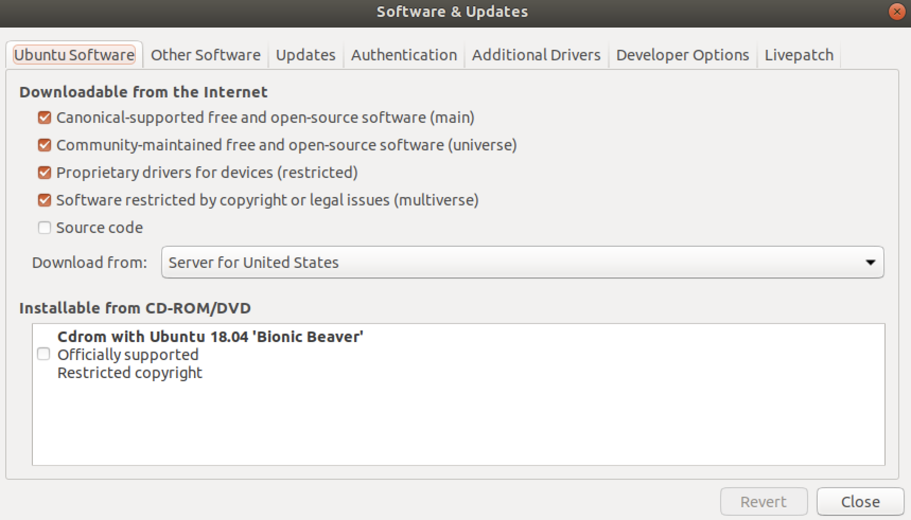
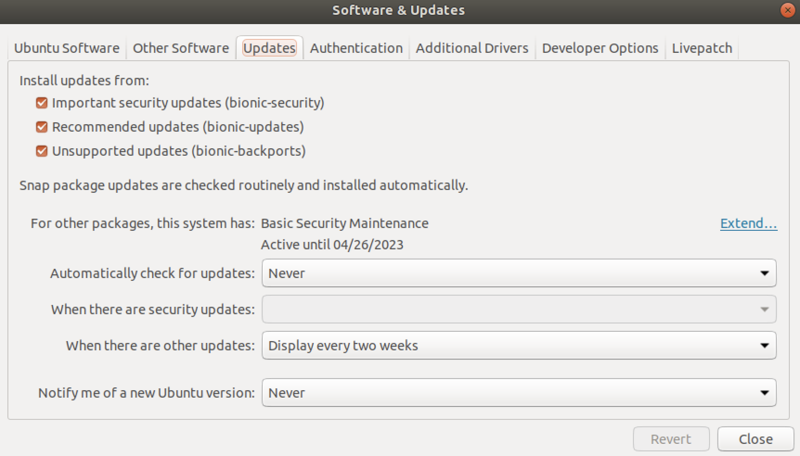

&emsp;
# ROS 环境配置

## 实验环境
- 电脑系统：Mac OS
- 工具：VMWARE Fusion
    - 虚拟机系统：官方下载镜像 Ubuntu18.04  https://releases.ubuntu.com/18.04/

## 安装ROS
- Melodic 版本

&emsp;
# 1 初始配置
## 1.1 源设置
### (1) 方式一：Software & Updates设置
<div align = center>
    
    <h4>Ubuntu Software</h4>
</div>

&emsp;

<div align = center>
    
    <h4>Updates</h4>
</div>

&emsp;
### (2) 方式二：/etc/apt/sources.list 设置
>US源
```bash
#deb cdrom:[Ubuntu 18.04.6 LTS _Bionic Beaver_ - Release amd64 (20210915)]/ bionic main restricted

# See http://help.ubuntu.com/community/UpgradeNotes for how to upgrade to
# newer versions of the distribution.
deb http://us.archive.ubuntu.com/ubuntu/ bionic main restricted
# deb-src http://us.archive.ubuntu.com/ubuntu/ bionic main restricted

## Major bug fix updates produced after the final release of the
## distribution.
deb http://us.archive.ubuntu.com/ubuntu/ bionic-updates main restricted
# deb-src http://us.archive.ubuntu.com/ubuntu/ bionic-updates main restricted

## N.B. software from this repository is ENTIRELY UNSUPPORTED by the Ubuntu
## team. Also, please note that software in universe WILL NOT receive any
## review or updates from the Ubuntu security team.
deb http://us.archive.ubuntu.com/ubuntu/ bionic universe
# deb-src http://us.archive.ubuntu.com/ubuntu/ bionic universe
deb http://us.archive.ubuntu.com/ubuntu/ bionic-updates universe
# deb-src http://us.archive.ubuntu.com/ubuntu/ bionic-updates universe

## N.B. software from this repository is ENTIRELY UNSUPPORTED by the Ubuntu 
## team, and may not be under a free licence. Please satisfy yourself as to 
## your rights to use the software. Also, please note that software in 
## multiverse WILL NOT receive any review or updates from the Ubuntu
## security team.
deb http://us.archive.ubuntu.com/ubuntu/ bionic multiverse
# deb-src http://us.archive.ubuntu.com/ubuntu/ bionic multiverse
deb http://us.archive.ubuntu.com/ubuntu/ bionic-updates multiverse
# deb-src http://us.archive.ubuntu.com/ubuntu/ bionic-updates multiverse

## N.B. software from this repository may not have been tested as
## extensively as that contained in the main release, although it includes
## newer versions of some applications which may provide useful features.
## Also, please note that software in backports WILL NOT receive any review
## or updates from the Ubuntu security team.
deb http://us.archive.ubuntu.com/ubuntu/ bionic-backports main restricted universe multiverse
# deb-src http://us.archive.ubuntu.com/ubuntu/ bionic-backports main restricted universe multiverse

## Uncomment the following two lines to add software from Canonical's
## 'partner' repository.
## This software is not part of Ubuntu, but is offered by Canonical and the
## respective vendors as a service to Ubuntu users.
# deb http://archive.canonical.com/ubuntu bionic partner
# deb-src http://archive.canonical.com/ubuntu bionic partner

deb http://security.ubuntu.com/ubuntu bionic-security main restricted
# deb-src http://security.ubuntu.com/ubuntu bionic-security main restricted
deb http://security.ubuntu.com/ubuntu bionic-security universe
# deb-src http://security.ubuntu.com/ubuntu bionic-security universe
deb http://security.ubuntu.com/ubuntu bionic-security multiverse
# deb-src http://security.ubuntu.com/ubuntu bionic-security multiverse
```

## 1.2 代理设置
在操作官方网站的安装指导前，在使用中的 Terminal 中设置代理
```shell
export https_proxy=http://zifuture.com:7890
```

&emsp;
# 2 按照官方指导安装 ROS
官方安装步骤：http://wiki.ros.org/melodic/Installation/Ubuntu

&emsp;
## (1) Setup your sources.list
- 这一步最重要，把 `deb http://packages.ros.org/ros/ubuntu (对应发行版本 lsb_release -sc) main` 写进 `/etc/apt/sources.list.d/ros-latest.list`

```shell
sudo sh -c 'echo "deb http://packages.ros.org/ros/ubuntu $(lsb_release -sc) main" > /etc/apt/sources.list.d/ros-latest.list'
```

&emsp;
## (2) Set up your keys
- 这一步要代理，否则会出错
```shell
wget https://raw.githubusercontent.com/ros/rosdistro/master/ros.asc 
```

- 到 ros.asc 的目录下执行
```shell
sudo apt-key add ros.asc
```

&emsp;
## (3) Installation
```shell
sudo apt update
```

Desktop-Full Install: (Recommended) : ROS, rqt, rviz, robot-generic libraries, 2D/3D simulators and 2D/3D perception
```shell
sudo apt install ros-melodic-desktop-full
```

&emsp;
## (4) Environment setup

```shell
echo "source /opt/ros/melodic/setup.bash" >> ~/.bashrc
source ~/.bashrc
```

&emsp;
## (5) Dependencies for building packages


```shell
sudo apt install python-rosdep python-rosinstall python-rosinstall-generator python-wstool build-essential
```

&emsp;
## (6) Initialize rosdep

```
sudo apt install python-rosdep
```
下面这一步经常出错，需要修改下面几个文件
- 把下面的几个文件里面的 `raw.githubusercontent.com/ros/rosdistro` 替换成:
- `gitee.com/zhao-xuzuo/rosdistro/raw` 或
- `gitee.com/wybros/rosdistro/raw`
    - /etc/ros/rosdep/sources.list.d/20-default
    - /usr/lib/python2.7/dist-packages/rosdistro/\_\_init__.py
    - /usr/lib/python2.7/dist-packages/rosdep2/gbpdistro_support.py
    - /usr/lib/python2.7/dist-packages/rosdep2/sources_list.py 
    - /usr/lib/python2.7/dist-packages/rosdep2/rep3.py
    
```
sudo rosdep init
rosdep update
```


